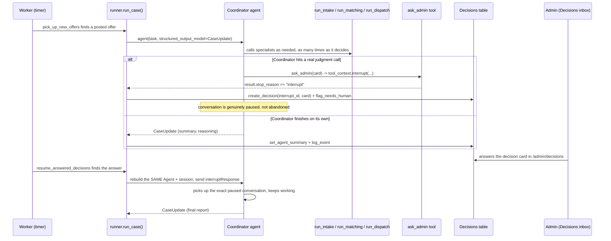
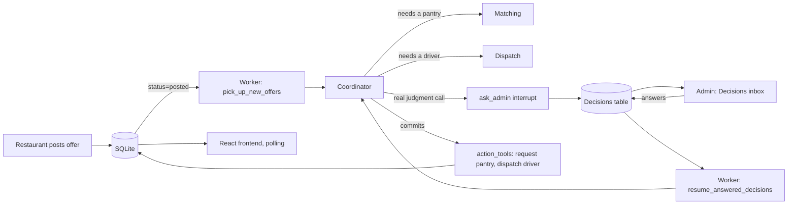

# Architecture

PantryPilot is three processes talking to one SQLite database:

- **web** (`pantrypilot/web/main.py`, FastAPI) — the API the React frontend calls. Restaurants post
  offers, pantries/drivers respond, admins log in here. It never runs an agent itself.
- **worker** (`pantrypilot/worker/`) — an APScheduler `BlockingScheduler` that wakes the agent team up
  on its own, on a timer. Nobody clicks a button to make the agents run.
- **frontend** (`frontend/`) — a React app that polls the API (`usePolling` hook) so every role's screen
  stays live without a websocket.

The worker runs three jobs (`pantrypilot/worker/jobs.py`):

| Job | Every | What it does |
|---|---|---|
| `pick_up_new_offers` | 15s | Finds offers with `status=posted` and calls `runner.run_case(offer_id)` for each. |
| `expire_stale_dispatch_requests` | 30s | Times out drivers who didn't respond, puts the offer back in the queue. |
| `resume_answered_decisions` | 10s | Finds decisions an admin just answered and calls `runner.resume_case(decision_id)`. |

`pantrypilot/agents/runner.py` is the **only** entry point into the agent system — nothing else builds a
Coordinator directly. That's deliberate: offer-claiming, error handling, and the final database write all
happen in exactly one place, every time.

## The agent team

PantryPilot uses the **agents-as-tools** pattern, not a fixed pipeline. A Coordinator agent
(`agents/coordinator_agent.py`) is given three tools — `run_intake`, `run_matching`, `run_dispatch` — each
of which is really a whole specialist agent underneath. The Coordinator decides, every single run, whether
to call them, in what order, how many times, and whether the result is good enough to commit or needs a
human. None of that branching is written in our code as an if/else chain; it's a decision the model makes
by reading each specialist's structured report.

- **Intake** (`agents/intake_agent.py`) — turns an offer's raw free-text into structured `OfferDetails`
  (estimated weight, allergens, perishability, concerns).
- **Matching** (`agents/matching_agent.py`) — investigates nearby pantries (capacity, fairness, dietary
  fit, opening hours) using `@tool`-decorated lookups in `agents/tools/pantry_tools.py`, and proposes one
  as a `MatchProposal`.
- **Dispatch** (`agents/dispatch_agent.py`) — finds an available driver for the chosen pantry using
  `agents/tools/driver_tools.py` and `geo_tools.py`, and proposes a `DispatchPlan`.
- **Coordinator** (`agents/coordinator_agent.py`) — the manager. Also holds the action tools
  (`agents/tools/action_tools.py`: send the pantry a request, dispatch the driver, mark delivered, etc.)
  and the `ask_admin` interrupt tool.

Every specialist's answer is a validated Pydantic object (`agents/schemas.py`), never loose prose — the
Coordinator reasons over real fields, not text it has to re-parse.

## The human-in-the-loop path

This is the part that makes PantryPilot "agents for humans" rather than a rule engine that never asks:

The pause is a real Strands interrupt (`tool_context.interrupt(...)` in
`agents/tools/human_tools.py`), not a status flag we invented — the model's own conversation stops
mid-turn and only continues once `resume_case()` sends `[{"interruptResponse": {...}}]` back into the
*same* agent object. Two things make the resume durable, both verified live end-to-end (see the Step 11
section of [`../PLAN.md`](../PLAN.md)):

- **Sessions** (`agents/sessions.py`): each offer gets a `FileSessionManager` under `data/sessions/`, so a
  brand-new `Agent` object built by a later `resume_case()` call — even after the worker process
  restarted — reloads the exact paused conversation from disk.
- **Two-turn resume**: `resume_case()` sends the `interruptResponse` on its own turn first, then asks for
  the structured `CaseUpdate` on a second turn. Combining them was observed live to sometimes confuse the
  model into calling a nonexistent `"json"` tool (see `agents/runner.py`'s comment).

## Data flow at a glance

## Observability

Every tool call the Coordinator (or a specialist) makes is captured by `ReasoningLogHook`
(`agents/hooks/reasoning_log_hook.py`), a Strands `HookProvider` listening for `BeforeToolCallEvent` /
`AfterToolCallEvent`, and written to the `agent_log` table — this is what backs the admin "Agent activity"
timeline. Separately, `agents/telemetry.py` wires up `StrandsTelemetry` for full OpenTelemetry traces
(`gen_ai.system.message`, `gen_ai.choice`, token usage) when `OTEL_CONSOLE=true`.

See the "Which Strands features we used and where" table in [`../README.md`](../README.md) for a full,
file-linked feature map.
