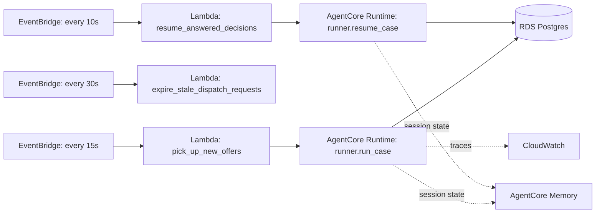

# AWS deployment path

PantryPilot runs locally today as three processes (web, worker, frontend) sharing a SQLite file — that's
the right shape for a hackathon build, and every piece maps cleanly onto managed AWS services without
changing the agent code itself. This doc describes that mapping; it is a design, not something wired up
in this repo beyond the stub entrypoint below.

## Component mapping

| Local piece | AWS equivalent | Why it maps cleanly |
|---|---|---|
| APScheduler `BlockingScheduler` (`pantrypilot/worker/`) | **EventBridge Scheduler** | The three jobs in `worker/jobs.py` are already independent, timer-triggered, no-argument functions — EventBridge just calls them on the same cadence (15s/30s/10s) instead of an in-process loop. |
| Each worker job | A small **Lambda** per job | `pick_up_new_offers`, `expire_stale_dispatch_requests`, `resume_answered_decisions` don't share state beyond the database, so each becomes its own Lambda with its own EventBridge rule. |
| `agents/runner.py`'s `run_case` / `resume_case` | **Bedrock AgentCore Runtime** entrypoint | These two functions are already the single, well-defined entry point into the agent system (see `docs/architecture.md`) — exactly the shape AgentCore Runtime expects: one function that takes a payload and runs an agent to completion or a pause. See `deploy/agentcore_app.py` below. |
| SQLite (`data/pantrypilot.db`) | **RDS for PostgreSQL** | SQLAlchemy already sits between the code and the database (`pantrypilot/database.py`); switching `DATABASE_URL` to a Postgres connection string and swapping the dialect is the only change needed — no query code touches SQLite-specific syntax. |
| `FileSessionManager` (`agents/sessions.py`, files under `data/sessions/`) | **AgentCore Memory**, or an **S3SessionManager** | Strands' `SessionManager` is an interface; `build_offer_session_manager()` is the one place that constructs it, so swapping in an AWS-backed session manager needs no change anywhere else that touches sessions. |
| `agents/telemetry.py` (`StrandsTelemetry` console exporter) | **CloudWatch**, via AgentCore's built-in observability | AgentCore Runtime ships OpenTelemetry spans (the same `gen_ai.*` spans we already print locally) to CloudWatch automatically — the local `OTEL_CONSOLE=true` path becomes an AgentCore setting rather than a code change. |
| `agents/model_provider.py`'s `bedrock` branch | **Amazon Bedrock** | Already implemented and selectable today via `MODEL_PROVIDER=bedrock` in `.env` — this is not future work, just a config change, useful if Groq's free-tier quota runs out during judging. |
| React frontend (`frontend/dist/` after `npm run build`) | **S3 + CloudFront**, or served by FastAPI directly | Static files; FastAPI can also just serve `frontend/dist/` itself for a single-URL demo (see README quickstart note). |
| Restaurant/pantry/driver/admin API (`pantrypilot/web/`) | **API Gateway + Lambda (or ECS/Fargate for the FastAPI app as-is)** | FastAPI's ASGI app runs unmodified behind either; no code here is worker- or agent-specific. |

## Trigger flow on AWS

## The AgentCore entrypoint stub

`deploy/agentcore_app.py` wraps `runner.run_case` with `bedrock_agentcore.runtime.BedrockAgentCoreApp`
(package `bedrock-agentcore`, pinned to `1.23.0` in the plan) so AgentCore Runtime has a single
`@app.entrypoint` function to call. It is **not needed to run PantryPilot locally** — the worker calls
`runner.run_case` directly — this file only matters once actually deploying to AgentCore Runtime, and is
included so the mapping above is concrete rather than hypothetical.

## What would change vs. what wouldn't

**Would change:** `DATABASE_URL` (→ Postgres), the session manager construction in `agents/sessions.py`
(→ AgentCore Memory or S3), how the three worker jobs are invoked (→ Lambda handlers instead of
`BlockingScheduler.add_job`), and how the app is deployed (→ containers/Lambda packaging).

**Would NOT change:** any agent, tool, or prompt in `pantrypilot/agents/`; the Coordinator's reasoning;
the interrupt/resume logic in `runner.py`; the Pydantic schemas; or a single line of the frontend. The
whole point of keeping `runner.py` as the one entry point (see `docs/architecture.md`) is that everything
above it — where it runs, what triggers it, where its state lives — is an infrastructure decision, not an
agent-design one.
